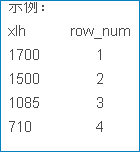
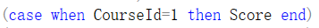

# **去重**
``` sql
-- distinct  
select distinct * from <表名>
```

# **排序**
``` sql
-- row_number()从1开始，为每一条分组记录返回一个数字，这里的ROW_NUMBER() OVER (ORDER BY xlh DESC) 是先把xlh列降序，再为降序以后的每条xlh记录返回一个序号  
select *,ROW_NUMBER() over (oredr by xlh DESC) from <表名>
```

  

``` sql
-- 表示根据COL1分组，在分组内部根据 COL2排序，而此函数计算的值就表示每组内部排序后的顺序编号（组内连续的唯一的)  
select *,ROW_NUMBER() over (partition BY COL1 ORDER BY COL2) from <表名>  
``` 
 
``` sql
-- RANK()给排序字段值相同的排名一样  
select *,RANK() over ([partition <XXXX> oredr by <XXXX>]) from <表名>  
```

``` sql
-- 对结果集进行排序，排名值没有间断。 特定行的排名等于该特定行之前不同排名值的数量加一  
select *,DENSE_RANK() over ([partition <XXXX> oredr by <XXXX>]) from <表名>  
```
partition by用于给结果集分组

## case when 语法
``` sql
case when <条件> then <值> end  
```
