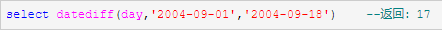
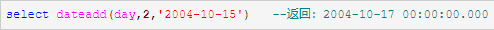

## **临时表**
with 名称 as (内容)

# 日期函数
## gatdata()
系统当前日期

## datediff
返回跨两个指定日期的日期和时间边界数  
datediff(日期类型,'被减日期(小)','指定日期(大)')  

## dateadd
在向指定日期加上一段时间的基础上，返回新的datetime值  
dateadd(日期类型,要加的数值,'指定日期')  

## datepart
返回代表指定日期的指定日期部分的整数  
datepart(日期类型,指定日期)  

## datename
返回代表指定日期的指定日期部分的字符串  
datename(日期类型,指定日期)  

