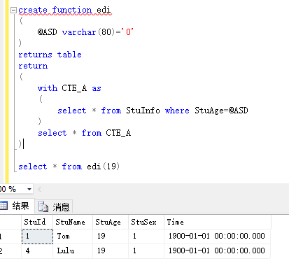

# 单语句表值函数

## **单语句的表值函数**
单语句表值函数又称内联表值函数，这类型函数以表的形式返回一个值，相当于一个参数化的视图
``` sql
--创建单语句表值型函数语法
create function 名称
(
    @参数名称 参数类型=(默认值)
)
returns table
return （select语句）
```

## **公用表表达式的递归调用**
递归的过程就是使用union all合并查询结果集的过程  

1. 递归 CTE 定义至少必须包含两个 CTE 查询定义，一个定位点成员和一个递归成员。可以定义多个定位点成员和递归成员；但必须将所有定位点成员查询定义置于第一个递归成员定义之前。所有 CTE 查询定义都是定位点成员，但它们引用 CTE 本身时除外。
2. 定位点成员必须与以下集合运算符之一结合使用：UNION ALL、UNION、INTERSECT 或 EXCEPT。在最后一个定位点成员和第一个递归成员之间，以及组合多个递归成员时，只能使用 UNION ALL 集合运算符。
3. 定位点成员和递归成员中的列数必须一致。
4. 递归成员中列的数据类型必须与定位点成员中相应列的数据类型一致。
5. 递归成员的 FROM 子句只能引用一次 CTEexpression_name。
6. 在递归成员的 CTE_query_definition 中不允许出现下列项：  
    （1）SELECT DISTINCT  
    （2）GROUP BY  
    （3）HAVING  
    （4）标量聚合  
    （5）TOP  
    （6）LEFT、RIGHT、OUTER JOIN（允许出现 INNER JOIN）  
    （7）子查询  
    （8）应用于对 CTE_query_definition 中的 CTE 的递归引用的提示。  

7.  无论参与的 SELECT 语句返回的列的为空性如何，递归 CTE 返回的全部列都可以为空。
8.  如果递归 CTE 组合不正确，可能会导致无限循环。例如，如果递归成员查询定义对父列和子列返回相同的值，则会造成无限循环。可以使用 MAXRECURSION 提示以及在 INSERT 、UPDATE 、DELETE 或 SELECT 语句的 OPTION 子句中的一个 0 到 32,767 之间的值，来限制特定语句所允许的递归级数，以防止出现无限循环。这样就能够在解决产生循环的代码问题之前控制语句的执行。服务器范围内的默认值是 100 。如果指定 0 ，则没有限制。每一个语句只能指定一个 MAXRECURSION 值。
9.  不能使用包含递归公用表表达式的视图来更新数据。
10.  可以使用 CTE 在查询上定义游标。递归 CTE 只允许使用快速只进游标和静态（快照）游标。如果在递归 CTE 中指定了其他游标类型，则该类型将转换为静态游标类型。
11.  可以在 CTE 中引用远程服务器中的表。如果在 CTE 的递归成员中引用了远程服务器，那么将为每个远程表创建一个假脱机，这样就可以在本地反复访问这些表。

1、公用表表达式可否用于单语句的表值函数当中  
  
  
2、公用表表达式的递归调用  
``` sql
--建一个公用表用来存储数据
with <公用表> as
(
	select * from <数据表> where <第一批数据的条件>
	union all
	select a.* from <数据表> a, <公用表> b
	where a.ScoreId = b.CourseId
)
select * from <公用表>

```


