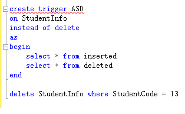

# 触发器

当数据库中表中的数据发生变化时,包括**insert,update,delete**任意操作,如果我们对该表写了对应的触发器,那么该触发器会自动执行  
  
instead of （之前触发）  
after（之后触发）  
``` sql
--创建触发器
create trigger <触发器名称>
on <表名>
<after | instead of> <delete | insert | update>
as
begin
    select * from inserted
    select * from deleted
end

--执行insert,update,delete语句
```



### 触发器有两个特殊的表：  
**instered表**(插入表)和**deleted表**(删除表)

|  | inserted表 | deleted表 |
| - | - | - |
| insert | 存放增加的记录 | 空 |
| delete | 空 | 存放被删除的记录 |
| update | 存放更新后的记录 | 存放更新前的记录 |

 Update数据的时候就是先删除表记录，然后增加一条记录。所以在inserted和deleted表就都有update后的数据记录了

``` sql
--禁用触发器
disable trigger tgr_message on student;
--启用触发器
enable trigger tgr_message on student;
```