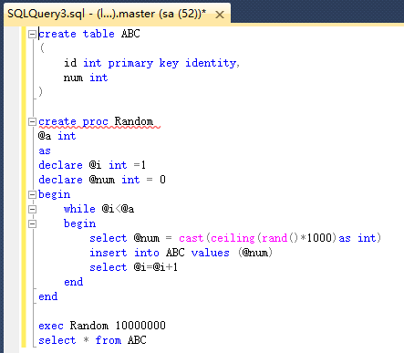
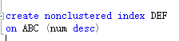
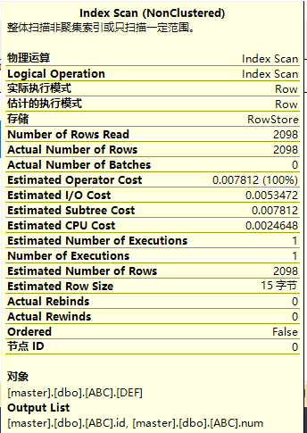
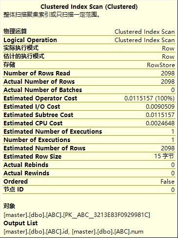

# 索引
SQL server提供了两种索引：**聚集索引**和**非聚集索引**  
**聚集索引** 就是正文内容本身就是一种按照一定规则排列的目录  
**非聚集索引** 就是目录纯粹是目录，正文纯粹是正文的排序方式  

## 练习

练习1：set nocount用法  

当 set nocount 为 ON 时，不返回计数（表示受 Transact-SQL 语句影响的行数）。当 set nocount 为 OFF 时，返回计数。  
即使当 set nocount 为 ON 时，也更新 @@ROWCOUNT 函数。

练习2：创建一个存储过程或者函数,传入一个数量,则创建相同数量的记录(这个记录中的数据随机生成的),要求生成一个至少1000万行记录的数据集  
  

练习3：在练习2的基础上创建一些索引，并且查询这些记录，验证索引对查询的提升  

  
执行索引  
  
没有执行索引  
  
