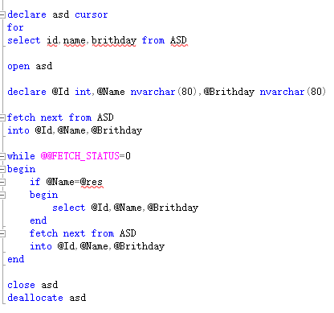

# 游标

结果集: 结果集就是select查询之后返回的所有行数据的集合。  
游标则是处理结果集的一种机制，它可以定位到结果集中的某一行，多数据进行读写，也可以移动游标定位到你所需要的行中进行操作数据。

```
步骤：
    1、定义游标    dcelare 游标名 cursor
    2、打开游标    open 游标名
    3、获取一条记录
    4、判断是否获取到数据，成功就处理数据，否则退出循环
    5、关闭游标    close 游标名
    6、释放游标    deallocate 游标名
```

``` sql
declare @username varchar(20),@UserId varchar(100)
    declare cursor_name cursor for --定义游标

    select TOP 10 UserId,UserName from UserInfo
    order by UserId DESC

    open cursor_name --打开游标
    fetch NEXT from cursor_name INTO  @UserId,@username  --抓取下一行游标数据

    while @@FETCH_STATUS = 0
        begin
            print '用户ID：'+@UserId+'            '+'用户名：'+@username
            fetch next from cursor_name into @UserId,@username
        end

    close cursor_name --关闭游标
    deallocate cursor_name --释放游标
```

  
@res 为用户指定的数据
