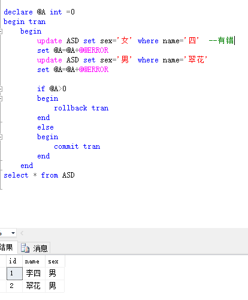
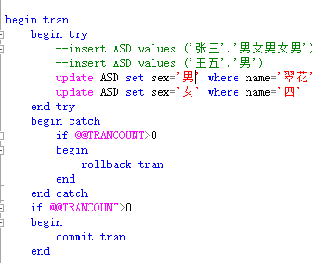

# 事务
SQL SERVER提供了两种索引：聚集索引 和 非聚集索引  
聚集索引 就是正文内容本身就是一种按照一定规则排列的目录  
非聚集索引 就是目录纯粹是目录，正文纯粹是正文的排序方式  

``` sql
-- 开始事务  
begin tran  

-- 回滚(撤销)事务  
rollback tran  

-- 提交事务  
commit tran 
```

**一旦事务提交或回滚，就结束事务**


## 事务分为三类：  
**显示事务**  
**隐式事务**  
**自动提交事务**  

  

  


事务只有遇到错误才会回滚，比如说数据类型不对或者数据超出数据类型范围，而想update更改数据时找不到要更改的数据时就会跳过这条语句去执行下一句语句